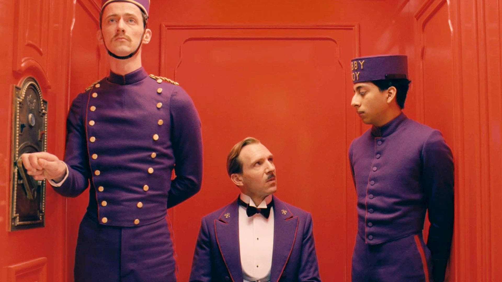

# 코드 정리

[HTML 코드]

```html
<!DOCTYPE html>
<html>
<head>
  <title>Overflow</title>
  <meta charset="utf-8">
  <link rel="stylesheet" href="styles.css">
</head>
<body>
  <div class="container">
    
    <div class="info">
      <h1>Grand Budapest Hotel</h1>
      <p>Wes Anderson heads to Europe for the first time with this Indian Paintbrush production starring Saoirse Ronan, Ralph Fiennes, Bill Murray, and Jude Law. Gustav H., the famous concierge at a legendary hotel situated in the Alps during the 1930's becomes the center of a farcical whirlwind of suspicion when one of his institution's oldest and richest patrons turns up dead, and she suspiciously leaves him her most priceless work of art -- a Renaissance painting of a boy with an apple. Infuriated that she left anything of value to anyone else, the woman's greedy and nefarious heir uses all manner of underhanded and illegal tactics to pin her death on Gustav and to silence anyone who questions his objective of inheriting every penny of her estate, leaving Gustav's trusted lobby boy Zero to clear Gustav's name and prove that the grand lady's killer is none other than her own son. ~ Jeremy Wheeler, Rovi</p>
    </div>
  </div>
</body>
</html>
```


[css 코드]

```css
* {
    box-sizing: border-box;
  }
  
  .container {
    width: 500px;
    height: 500px;
  }
  
  .info {
    /* 
    1. 세로 길이를 220px로 설정해주세요.
    2. 3px 두께에 색은 #B72920인 테두리를 입혀주세요.
    3. 문구를 스크롤하면서 볼 수 있도록 overflow 속성을 설정해주세요.
    4. 글이 테두리에 너무 붙어 있지 않도록 15px의 여유 공간을 주세요.
    */
    height: 220px;
    border: 3px solid #B72920;
    overflow: scroll;
    padding: 15px;
  }
  
  img {
    width: 100%;
    display: block;
  }
  
  h1 {
    margin: 0;
    margin-bottom: 10px;
  }
  
  p {
    margin: 0;
  }
```
